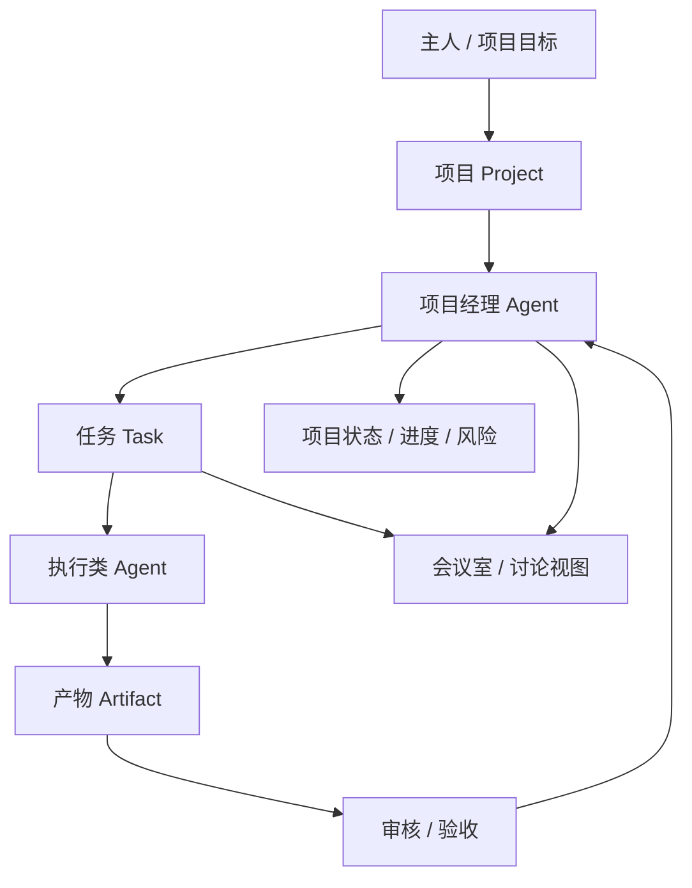

# Agent Monitor 多 Agent 项目协作模型

> 状态: 草案
> 更新: 2026-05-21
> 目的: 明确项目管理、任务管理、不同角色 Agent 协作、Git/产物管理与会议室可视化之间的关系。

---

## 1. 核心判断

Agent Monitor 的核心不应是“聊天室”，而应是一个本地多 Agent 项目协作平台。

会议室模式可以保留，但它的定位是协作过程的可视化视图，而不是协作引擎本身。真正的协作应围绕项目、任务、角色、产物和审核流转展开。

核心原则：

```text
Project -> Project Manager Agent -> Task -> Worker/Reviewer Agent -> Artifact -> Review -> Project State
```

其中，项目经理 Agent 位于项目之下、任务之上，负责把项目目标拆成任务、分配给不同 Agent、追踪进度，并在需要时组织协作。

---

## 2. 层级关系



这个层级刻意避免把所有 Agent 平铺成聊天室成员。不同 Agent 的权责不同：

- 项目经理 Agent: 项目运行控制层，负责拆任务、分配任务、盯进度。
- 执行 Agent: 任务执行层，负责代码、文档、调研、测试等具体产物。
- 审核 Agent: 质量控制层，负责 review、测试、验收建议。
- 会议室: 展示层，用于任务讨论、评审沟通、过程回放。

---

## 3. Agent 角色不是都等于开发者

不同平台、不同 Agent 可能承担完全不同的职责。Git 是重要的版本边界，但不是所有 Agent 的唯一产物方式。

| Agent 类型 | 主要职责 | 典型产物 | 是否必须写 Git |
|---|---|---|---|
| project_manager | 拆任务、分配任务、追踪进度、发现阻塞 | 任务状态、风险清单、日报、分配建议 | 否 |
| analyst | 需求分析、范围澄清、验收标准 | PRD、需求清单、验收标准 | 可选 |
| developer | 实现功能、修 bug、重构 | 代码 diff、commit、实现说明 | 通常是 |
| tester | 测试计划、测试执行、缺陷定位 | 测试报告、bug list、测试代码 | 可选 |
| reviewer | 审查代码/文档/方案风险 | review 评论、修改建议 | 否 |
| researcher | 调研方案、比较工具、查资料 | research note、对比表、链接清单 | 否 |
| writer | 文档、发布说明、用户说明 | README、教程、release note | 可选 |

因此协作抽象不应是：

```text
Agent -> Git commit
```

而应是：

```text
Agent -> Task Work Item -> Artifact / Event / Git Change
```

---

## 4. 核心对象模型

### 4.1 Project

项目是协作入口，由用户配置或从本地目录导入。

```json
{
  "id": "agent-monitor",
  "name": "Agent Monitor",
  "path": "/Users/hanyongfeng/AI/agent-monitor",
  "managerAgentId": "pm-agent",
  "goals": ["本地多 Agent 项目协作", "状态监控", "会议室可视化"],
  "status": "active",
  "repo": {
    "type": "git",
    "mainBranch": "master"
  }
}
```

关键字段：

- `managerAgentId`: 项目经理 Agent，负责项目下的任务体系。
- `path`: 本地项目路径。
- `goals`: 项目目标，可由主人输入，也可由项目经理 Agent 细化。
- `repo`: Git 信息是项目能力之一，不代表所有任务都必须写 Git。

### 4.2 Project Manager Agent

项目经理 Agent 是 Project 和 Task 之间的控制层。

```json
{
  "agentId": "pm-agent",
  "role": "project_manager",
  "scope": "project",
  "projectId": "agent-monitor",
  "permissions": [
    "task:create",
    "task:assign",
    "task:reprioritize",
    "task:request_review",
    "meeting:start",
    "project:report"
  ],
  "capabilities": [
    "task_planning",
    "progress_tracking",
    "assignment",
    "risk_detection"
  ]
}
```

项目经理 Agent 的职责：

- 根据项目目标拆解任务。
- 判断任务类型和优先级。
- 按 Agent 能力、负载和历史表现分配任务。
- 追踪任务是否卡住、超时或需要协作。
- 触发 review、测试、会议讨论。
- 汇总项目状态、风险和下一步建议。

### 4.3 Task

任务是协作的最小调度单位。

```json
{
  "id": "task_001",
  "projectId": "agent-monitor",
  "title": "梳理多 Agent 协作模型",
  "type": "analysis",
  "status": "in_progress",
  "priority": "high",
  "createdBy": "pm-agent",
  "assigneeAgentId": "analyst-agent",
  "reviewerAgentId": "pm-agent",
  "dependencies": [],
  "expectedArtifacts": ["analysis_doc", "decision_record"]
}
```

任务类型建议：

| 类型 | 说明 | 是否需要 Git 工作区 |
|---|---|---|
| analysis | 需求分析、方案设计 | 可选 |
| research | 调研与资料整理 | 否 |
| code_change | 代码实现或修复 | 是 |
| test_change | 测试代码或测试用例 | 通常是 |
| test_run | 执行测试并汇报结果 | 否 |
| doc_change | 文档修改 | 可选 |
| review | 审核代码/文档/方案 | 否 |
| project_management | 进度、分配、日报、风险 | 否 |

### 4.4 Artifact

产物是 Agent 执行任务后的可审查结果。

```json
{
  "id": "artifact_001",
  "taskId": "task_001",
  "createdBy": "analyst-agent",
  "type": "analysis_doc",
  "path": "docs/collaboration-model.md",
  "status": "submitted",
  "summary": "提出 Project / Task / Agent Role / Artifact 四层模型"
}
```

Artifact 可以是：

- 代码 diff
- Git commit / branch / worktree
- 文档文件
- 测试报告
- bug 列表
- 需求说明
- 任务拆解
- 项目日报
- 决策记录
- 风险清单
- 外部链接
- 纯状态事件

### 4.5 Event Log

事件日志是 UI、会议室、任务看板和回放的共同数据源。

```json
{
  "eventId": "evt_001",
  "projectId": "agent-monitor",
  "taskId": "task_001",
  "type": "task.assigned",
  "actorAgentId": "pm-agent",
  "targetAgentId": "analyst-agent",
  "payload": {
    "reason": "该任务需要先澄清协作模型"
  },
  "timestamp": 1770000000000
}
```

建议事件类型：

- `project.created`
- `project.updated`
- `task.created`
- `task.assigned`
- `task.started`
- `task.blocked`
- `task.need_help`
- `task.review_requested`
- `task.review_commented`
- `task.completed`
- `task.rejected`
- `artifact.created`
- `artifact.submitted`
- `artifact.accepted`
- `artifact.rejected`
- `meeting.started`
- `meeting.message`
- `meeting.decision`
- `meeting.ended`

---

## 5. Git 的位置

Git 是项目级事实记录和版本边界，而不是所有 Agent 的唯一协作方式。

适合使用 Git/worktree 的场景：

- 开发 Agent 修改代码。
- 测试 Agent 补充测试代码。
- 文档 Agent 修改项目文档。
- 分析 Agent 把方案沉淀为仓库内文档。
- 需要 diff、review、回滚的任务。

不一定需要 Git 的场景：

- 项目经理 Agent 分配任务。
- 研究 Agent 只提交调研结论。
- 测试 Agent 只跑测试并提交报告。
- Reviewer Agent 只给 review 评论。
- 会议讨论和过程回放。

推荐策略：

```text
任务类型决定是否创建 Git branch/worktree，而不是 Agent 类型决定。
```

---

## 6. 推荐 MVP 闭环

第一阶段不追求自动化一切，只跑通最小可信闭环：

```text
1. 用户配置本地项目
2. 为项目指定项目经理 Agent
3. 项目经理 Agent 根据项目目标创建任务
4. 用户确认或调整任务
5. 项目经理 Agent 分配任务给执行 Agent
6. 执行 Agent 提交 Artifact
7. Reviewer / 用户审核 Artifact
8. 任务状态更新
9. 项目经理 Agent 汇总项目进度
```

如果任务类型是 `code_change` 或 `test_change`：

```text
创建隔离 branch/worktree -> Agent 执行 -> 生成 diff/summary -> review -> merge/reject
```

如果任务类型是 `analysis`、`research` 或 `project_management`：

```text
Agent 提交结构化报告/事件 -> review -> 更新项目状态
```

---

## 7. 会议室模式的正确定位

会议室模式保留，但它不是主协作流程。

它应该作为以下场景的可视化视图：

1. **任务讨论**
   - 某个任务出现争议或阻塞。
   - 项目经理 Agent 拉相关 Agent 讨论。

2. **评审沟通**
   - 执行 Agent 提交产物。
   - Reviewer 提出意见。
   - 会议室展示讨论过程和结论。

3. **决策记录**
   - 多 Agent 讨论后形成 `meeting.decision`。
   - 决策回写到任务或项目。

4. **过程回放**
   - 从 Event Log 回放任务从创建到完成的关键过程。

因此会议室消费事件流：

```text
agent.joined
agent.speaking
agent.message
task.blocked
task.review_requested
meeting.decision
meeting.ended
```

而不是自己发明 demo 数据。

---

## 8. 需要避免的误区

### 8.1 不要把协作等同于群聊

群聊可以展示讨论，但协作需要任务、产物、状态和审核。

### 8.2 不要要求所有 Agent 都写 Git

需求分析、测试执行、项目管理、review 都可能不产生代码提交。

### 8.3 不要让可视化层决定业务模型

像素会议室很好玩，但它应该读取事件流，而不是成为业务事实来源。

### 8.4 不要把所有 Agent 权限拉平

项目经理 Agent、执行 Agent、Reviewer Agent 的权限应该不同。

---

## 9. 下一步设计任务

建议后续按这个顺序推进：

1. 定义 `Project` / `Task` / `AgentRole` / `Artifact` / `Event` 的 JSON schema。
2. 在 `ProjectManager` 中加入 `managerAgentId`。
3. 新增 `TaskManager`，支持任务创建、分配、状态流转。
4. 新增 `ArtifactStore`，记录不同类型产物。
5. 新增 `AgentCapabilityRegistry`，按能力分配任务。
6. 让 `MessageRouter` 从聊天转发器升级为事件投递器。
7. 让会议室读取 Event Log，不再依赖硬编码 demo。
