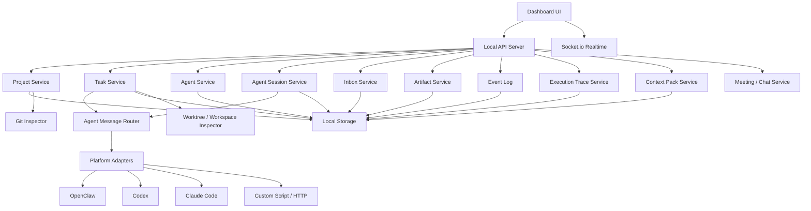
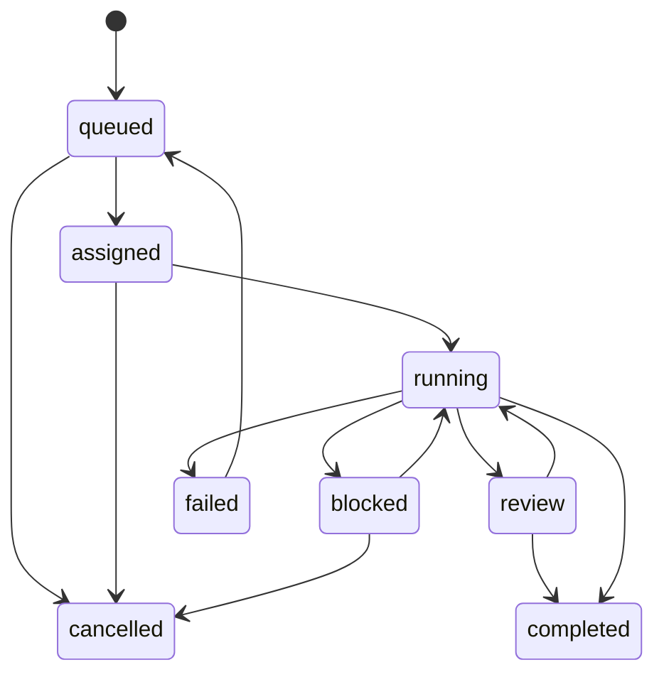

# 个人 AI 工具驾驶舱设计文档

> 项目: Agent Monitor
> 版本: 0.3.0
> 更新: 2026-05-21
> 状态: Milestone 1 后设计补充

---

## 1. 设计目标

Agent Monitor 的目标是做一个轻量、本地优先、可扩展的个人 AI 工具驾驶舱。

当前 `dashboard/` 已经提供 Vite + React 原型，入口为 `http://localhost:5173`。后续设计应在现有原型上补齐主链路，而不是另起一个重型系统。

设计重点：

- 项目管理是主入口。
- 任务管理是协作核心。
- Agent View 是后台会话监督层。
- Inbox 是用户介入入口。
- Artifact 和 Event 是事实记录。
- ExecutionTrace 是任务可观测层。
- Git / Worktree 是代码类任务隔离和审查通道。
- 会议室是体验增强，不是核心调度引擎。

## 2. 当前实现基线

Milestone 1 已有能力：

- `dashboard/` 前端驾驶舱，Vite + React + Tailwind + zustand。
- 总览、项目、任务、Agent、设置页面。
- 项目列表、任务看板/列表、新建项目、新建任务、Agent 列表。
- Fastify API、Socket.io、基础事件日志、Agent 注册、JSON 种子数据。

当前需要优先补齐：

- 项目详情页稳定性和信息结构。
- Agent View / 会话监督。
- 待我处理 Inbox。
- 任务执行轨迹。
- Artifact Review 最小闭环。
- Context Pack 和 Handoff。

## 3. 总体架构



## 4. 技术选型

| 层级 | 推荐 | 说明 |
|------|------|------|
| 当前前端 | Vite + React + Tailwind + zustand | Milestone 1 已采用，适合快速迭代 |
| 后续前端 | 继续 Vite 或迁移 Next.js | 个人本地工具无需急着迁移 |
| API | Node.js + Fastify | 轻量、启动快、适合本地工具 |
| Realtime | Socket.io | 任务、会话、事件实时推送 |
| 存储 | JSON 起步，SQLite 作为下一步 | 单机、本地、可迁移 |
| Git | 只读 shell / simple-git | 读取状态、diff、branch、commit |
| 会议室 | Phaser 3 | P3 体验增强 |

不建议在近期引入：

- Redis
- Prisma
- 云端数据库
- 企业账户系统
- 重型消息队列
- 付费素材或付费 API 依赖

## 5. 核心模块

### 5.1 Project Service

职责：

- 管理本地项目配置。
- 维护项目与 PM Agent、参与 Agent、任务、产物的关系。
- 聚合项目状态。
- 读取 Git 状态。
- 提供项目详情页所需数据。

关键方法：

```ts
listProjects(): Project[]
getProject(projectId): ProjectDetail
createProject(input): Project
updateProject(projectId, patch): Project
archiveProject(projectId): void
summarizeProject(projectId): ProjectSummary
```

项目详情必须包含：

- 项目目标。
- PM Agent。
- 参与 Agent。
- 任务看板。
- Artifact 摘要。
- 事件时间线。
- Git 状态。
- Context Pack。

### 5.2 Agent Service

职责：

- 管理 Agent 配置。
- 接收 Agent 注册和心跳。
- 维护 Agent 状态、角色、能力、平台和质量指标。

Agent 状态：

```text
idle
working
waiting_user
meeting
blocked
away
error
```

关键方法：

```ts
registerAgent(input): Agent
heartbeat(agentId, payload): Agent
updateStatus(agentId, status): Agent
assignTask(agentId, taskId): void
listAgents(filter): Agent[]
getAgentMetrics(agentId): AgentMetrics
```

### 5.3 Agent Session Service

职责：

- 记录真实 Agent 会话。
- 维护会话与项目、任务、Agent 的关系。
- 保存最近输出、等待用户状态、运行时长和原平台引用。
- 为 Agent View 提供列表和详情数据。

会话状态：

```text
idle
running
waiting_user
completed
failed
detached
```

关键方法：

```ts
listSessions(filter): AgentSession[]
getSession(sessionId): AgentSessionDetail
upsertSession(input): AgentSession
updateSessionStatus(sessionId, status, patch): AgentSession
appendSessionOutput(sessionId, output): void
replyToSession(sessionId, message): DeliveryResult
detachSession(sessionId): void
```

### 5.4 Inbox Service

职责：

- 汇总所有需要用户介入的事项。
- 将等待输入、权限请求、review 请求、任务阻塞、失败任务转成统一 InboxItem。
- 处理后写入 Event Log。

Inbox 类型：

```text
decision_required
permission_request
blocked_task
review_request
failed_task
handoff_needed
```

Inbox 状态：

```text
open
snoozed
resolved
ignored
converted_to_task
```

关键方法：

```ts
listInbox(filter): InboxItem[]
createInboxItem(input): InboxItem
resolveInboxItem(id, resolution): InboxItem
snoozeInboxItem(id, until): InboxItem
convertInboxItemToTask(id, input): Task
```

### 5.5 Task Service

职责：

- 创建、分配、执行、阻塞、review、完成任务。
- 管理任务依赖。
- 关联 AgentSession、Artifact、ExecutionTrace 和 Worktree。

任务状态机：



关键方法：

```ts
createTask(input): Task
assignTask(taskId, agentId): Task
startTask(taskId, agentId): Task
updateProgress(taskId, progress): Task
markBlocked(taskId, reason): Task
requestReview(taskId, reviewerId): Task
completeTask(taskId, result): Task
cancelTask(taskId): Task
createHandoff(taskId, input): HandoffSummary
```

### 5.6 Execution Trace Service

职责：

- 保存任务执行过程。
- 记录状态变化、工具调用、Agent 输出摘要、文件变化、测试结果和失败原因。
- 支持任务详情页按时间线回放。

Trace entry 类型：

```text
status_changed
agent_output
tool_call
file_changed
test_result
artifact_linked
user_intervention
error
handoff_created
```

关键方法：

```ts
appendTrace(taskId, entry): TraceEntry
listTrace(taskId): TraceEntry[]
summarizeTrace(taskId): TraceSummary
detectTraceAnomaly(taskId): TraceAlert[]
```

### 5.7 Artifact Service

职责：

- 保存任务产物索引。
- 支持 Git 产物、文件产物、文本产物和外部链接。
- 支持 review、接受、退回。
- 为产物页提供待审查队列。

Artifact 类型：

```text
git_diff
git_commit
git_branch
document
test_report
bug_list
analysis_note
decision_record
link
message_summary
handoff_summary
```

Artifact 状态：

```text
draft
submitted
accepted
rejected
superseded
```

关键方法：

```ts
createArtifact(input): Artifact
listArtifactsByTask(taskId): Artifact[]
listArtifactsByProject(projectId): Artifact[]
listReviewQueue(filter): Artifact[]
acceptArtifact(artifactId): Artifact
rejectArtifact(artifactId, reason): Artifact
```

### 5.8 Event Log

职责：

- 保存事实事件。
- 作为 UI 时间线、项目汇总、会议回放、PM Agent 汇总的数据源。

设计要求：

- Event 只追加，不随意修改。
- UI 聚合状态可以重算。
- 事件 payload 保持小而清晰。
- Project、Task、AgentSession、Inbox、Trace、Artifact 的关键变化都要写事件。

### 5.9 Context Pack Service

职责：

- 管理项目上下文包。
- 为 PM Agent 拆任务和执行 Agent 接任务提供稳定上下文。
- 记录项目目标、技术栈、关键目录、常用命令、规则、最近决策和禁止事项。

关键方法：

```ts
getContextPack(projectId): ContextPack
updateContextPack(projectId, patch): ContextPack
renderTaskContext(taskId, options): string
appendDecision(projectId, decision): ContextPack
```

### 5.10 Message Router 与 Adapter

职责：

- 把任务、消息、会议邀请投递给不同平台 Agent。
- 接收不同平台 Agent 的状态回传。
- 隔离平台差异。

统一接口：

```ts
interface AgentAdapter {
  platform: string;
  capabilities: AdapterCapability[];
  sendTask(agent: Agent, task: Task): Promise<DeliveryResult>;
  sendMessage(agent: Agent, message: ChatMessage): Promise<DeliveryResult>;
  replyToSession?(session: AgentSession, message: string): Promise<DeliveryResult>;
  checkStatus?(agent: Agent): Promise<AgentStatus>;
  listSessions?(): Promise<AgentSession[]>;
}
```

原则：

- 投递失败要记录事件，但不能阻塞 API。
- 所有 adapter 都要有 timeout。
- adapter 能力必须显式声明：是否支持 reply / pause / stop / session list。
- 不同平台只影响 adapter，不污染核心任务模型。

### 5.11 Git / Workspace Service

职责：

- 读取 Git 状态。
- 识别分支、未提交文件、最近 commit。
- 记录任务对应 branch / worktree。
- 为多个代码 Agent 并行任务提供工作区隔离信息。

关键方法：

```ts
getGitStatus(projectId): GitStatus
listTaskWorkspaces(projectId): TaskWorkspace[]
linkWorkspaceToTask(taskId, workspace): TaskWorkspace
listChangedFiles(taskId): ChangedFile[]
```

### 5.12 Meeting / Chat Service

职责：

- 保存会议消息。
- 保存会议决策。
- 提供列表模式和会议室可视化的数据。
- 把会议决策转成任务事件或 Artifact。

设计边界：

- 会议室不直接调度任务。
- 会议室不直接修改 Git。
- 会议室失败不影响任务执行。

## 6. 数据存储设计

### 6.1 MVP 存储方案

当前可继续使用 JSON 文件快速迭代，但下一阶段建议迁移到 SQLite。

原因：

- 单文件，适合个人本地使用。
- 比多个 JSON 文件更适合事件、trace、inbox 和搜索。
- 不需要额外服务。
- 迁移成本低。

### 6.2 表设计建议

```text
projects
agents
agent_sessions
inbox_items
tasks
artifacts
events
trace_entries
context_packs
task_workspaces
meetings
meeting_messages
settings
```

### 6.3 StorageProvider

核心服务不直接依赖具体存储。

```ts
interface StorageProvider {
  projects: ProjectRepository;
  agents: AgentRepository;
  sessions: AgentSessionRepository;
  inbox: InboxRepository;
  tasks: TaskRepository;
  artifacts: ArtifactRepository;
  events: EventRepository;
  traces: TraceRepository;
  contextPacks: ContextPackRepository;
  meetings: MeetingRepository;
}
```

## 7. API 设计

### 7.1 Project API

| 方法 | 路径 | 说明 |
|------|------|------|
| GET | `/api/projects` | 项目列表 |
| POST | `/api/projects` | 创建项目 |
| GET | `/api/projects/:id` | 项目详情 |
| PATCH | `/api/projects/:id` | 更新项目 |
| POST | `/api/projects/:id/archive` | 归档项目 |
| GET | `/api/projects/:id/timeline` | 项目事件时间线 |
| GET | `/api/projects/:id/git` | Git 状态 |
| GET | `/api/projects/:id/context-pack` | 上下文包 |
| PATCH | `/api/projects/:id/context-pack` | 更新上下文包 |
| GET | `/api/projects/:id/workspaces` | 任务工作区 |

### 7.2 Agent API

| 方法 | 路径 | 说明 |
|------|------|------|
| GET | `/api/agents` | Agent 列表 |
| POST | `/api/agents` | 手动添加 Agent |
| POST | `/api/agents/register` | Agent 主动注册 |
| POST | `/api/agents/:id/heartbeat` | 心跳 |
| PATCH | `/api/agents/:id/status` | 更新状态 |
| GET | `/api/agents/:id/sessions` | 某 Agent 会话 |
| GET | `/api/agents/:id/metrics` | Agent 质量指标 |

### 7.3 Agent View / Session API

| 方法 | 路径 | 说明 |
|------|------|------|
| GET | `/api/sessions` | 会话列表 |
| GET | `/api/sessions/:id` | 会话详情 |
| POST | `/api/sessions` | 创建或上报会话 |
| PATCH | `/api/sessions/:id` | 更新会话状态和最近输出 |
| POST | `/api/sessions/:id/reply` | 从驾驶舱回复会话 |
| POST | `/api/sessions/:id/detach` | 标记会话脱离监督 |

### 7.4 Inbox API

| 方法 | 路径 | 说明 |
|------|------|------|
| GET | `/api/inbox` | 待我处理列表 |
| POST | `/api/inbox` | 创建待处理事项 |
| POST | `/api/inbox/:id/resolve` | 处理完成 |
| POST | `/api/inbox/:id/snooze` | 稍后提醒 |
| POST | `/api/inbox/:id/convert-to-task` | 转成任务 |

### 7.5 Task API

| 方法 | 路径 | 说明 |
|------|------|------|
| GET | `/api/tasks` | 任务列表 |
| POST | `/api/tasks` | 创建任务 |
| GET | `/api/tasks/:id` | 任务详情 |
| PATCH | `/api/tasks/:id` | 更新任务 |
| POST | `/api/tasks/:id/assign` | 分配任务 |
| POST | `/api/tasks/:id/start` | 开始任务 |
| POST | `/api/tasks/:id/block` | 标记阻塞 |
| POST | `/api/tasks/:id/request-review` | 请求 review |
| POST | `/api/tasks/:id/complete` | 完成任务 |
| GET | `/api/tasks/:id/trace` | 任务执行轨迹 |
| POST | `/api/tasks/:id/handoff` | 创建交接摘要 |

### 7.6 Artifact API

| 方法 | 路径 | 说明 |
|------|------|------|
| GET | `/api/artifacts` | 产物列表 |
| POST | `/api/artifacts` | 提交产物 |
| GET | `/api/artifacts/review-queue` | 待审查产物 |
| GET | `/api/tasks/:id/artifacts` | 某任务产物 |
| POST | `/api/artifacts/:id/accept` | 接受产物 |
| POST | `/api/artifacts/:id/reject` | 拒绝产物 |

### 7.7 Meeting API

| 方法 | 路径 | 说明 |
|------|------|------|
| POST | `/api/meetings` | 创建会议 |
| POST | `/api/meetings/:id/messages` | 添加发言 |
| POST | `/api/meetings/:id/decision` | 记录决策 |
| POST | `/api/meetings/:id/end` | 结束会议 |
| GET | `/api/meetings/:id/replay` | 回放会议 |

## 8. UI 设计

### 8.1 导航结构

```text
总览
项目
任务
Agent View
Agent
Inbox
产物
会议
设置
```

当前侧边栏已有总览、项目、任务、Agent、产物、会议、设置。下一阶段建议新增 Agent View 和 Inbox，或者先把 Inbox 放到总览顶部，再独立成页面。

### 8.2 总览页

目的：让用户一眼看到今天该看哪里。

模块：

- 待我处理数量。
- 活跃后台会话数量。
- 阻塞任务数。
- 待 review 产物数。
- 在线 Agent 数。
- 今日完成任务。
- 最近事件。
- 异常 Agent / 长任务提醒。

### 8.3 项目页

目的：管理本地项目。

展示：

- 项目名称、路径、状态。
- PM Agent。
- 参与 Agent。
- 任务进度。
- 最近更新时间。
- Git 状态摘要。

### 8.4 项目详情页

目的：成为单个项目的控制台。

区域：

- 项目目标。
- PM Agent 和参与 Agent。
- 任务看板。
- Artifact 列表。
- Git 状态。
- 事件时间线。
- Context Pack。
- Agent Session。
- 风险和阻塞。

### 8.5 任务页

目的：集中管理所有项目任务。

视图：

- 看板视图：queued / running / blocked / review / done。
- 列表视图：适合搜索和筛选。

任务详情应包含：

- 基本信息。
- 当前 AgentSession。
- ExecutionTrace。
- Artifact。
- 评论 / 用户介入记录。
- Handoff 摘要。

### 8.6 Agent View 页

目的：监督所有真实 Agent 会话。

展示：

- 会话状态。
- 所属项目和任务。
- 平台和 Agent。
- 最近输出。
- 运行时长。
- 是否等待用户。
- 快捷操作：查看、回复、跳转原平台、标记处理、暂停/终止。

### 8.7 Agent 页

目的：看清 Agent 能力、负载和质量。

展示：

- Agent 名称。
- 平台。
- 角色。
- 状态。
- 当前项目。
- 当前任务。
- 最近活动。
- 能力标签。
- 成功率、失败次数、平均耗时、退回次数。

### 8.8 Inbox 页

目的：集中处理需要用户介入的事项。

展示：

- 权限请求。
- 决策请求。
- 阻塞任务。
- Review 请求。
- 失败任务。
- Handoff 请求。

交互：

- 处理完成。
- 稍后提醒。
- 转任务。
- 跳转相关任务 / 会话 / 产物。

### 8.9 产物页

目的：审查任务结果。

展示：

- 待 review 产物。
- Git diff / commit / branch。
- 文档、报告、调研结论、决策记录。
- 产物状态：draft / submitted / accepted / rejected。

### 8.10 会议页

目的：体验增强和过程回放，不抢主线。

模式：

- 列表模式：聊天记录、决策、关联任务。
- 像素会议室模式：Phaser 3 会议室可视化。

## 9. 关键流程

### 9.1 用户添加项目

```text
选择本地目录
-> 填写项目名称和目标
-> 指定 PM Agent
-> 选择参与 Agent
-> 创建项目
-> 生成 project.created 事件
```

### 9.2 PM Agent 拆任务

```text
用户输入项目目标
-> PM Agent 读取 ContextPack
-> PM Agent 生成任务建议
-> 用户确认或修改
-> Task Service 创建任务
-> 生成 task.created 事件
```

### 9.3 Agent View 监督后台会话

```text
Agent 会话启动或上报
-> Agent Session Service 更新状态
-> 如果等待用户，创建 InboxItem
-> 用户在 Agent View peek 最近输出
-> 用户回复或跳转原平台
-> 会话继续执行或完成
-> 关联任务和 Artifact
```

### 9.4 开发 Agent 执行代码任务

```text
任务分配给开发 Agent
-> Adapter 投递任务
-> Agent 标记 running
-> 创建 AgentSession 和 ExecutionTrace
-> Agent 修改代码
-> Trace 记录文件变更和工具调用
-> Artifact 记录 diff / branch / commit
-> 请求 review
-> reviewer 接受或退回
-> 任务完成
```

### 9.5 Handoff 交接

```text
任务失败 / 阻塞 / 长时间运行
-> 生成 handoff summary
-> 创建 InboxItem 让用户确认
-> 用户选择接手 Agent
-> 新 Agent 读取 ContextPack + Trace + Artifact
-> 继续执行任务
```

### 9.6 会议决策沉淀

```text
会议开始
-> Agent 发言
-> 形成 decision
-> decision 关联项目或任务
-> 生成 decision_record Artifact
-> 会议结束
```

## 10. 权限与安全边界

默认允许：

- 读取项目目录基本信息。
- 读取 Git 状态。
- 保存任务、事件、Trace、Inbox 和 Artifact 索引。
- 接收 Agent 状态和会话上报。

需要用户确认：

- 删除项目配置。
- 删除任务或产物记录。
- 执行 Git commit / push / reset。
- 从驾驶舱向真实 Agent 会话发送回复。
- 暂停、终止或接管真实 Agent 会话。
- 调用外部 API 发送敏感内容。

默认禁止：

- 自动上传项目源码到云端。
- 自动暴露公网服务。
- 自动删除本地项目文件。

## 11. 轻量化实现建议

### 11.1 后端

- 保持 Fastify 单进程。
- 服务启动时加载本地数据。
- 写操作同步落盘。
- 所有事件追加写入。
- 会话同步和异常检测保持轻量，不做重型 tracing 平台。

### 11.2 前端

- 优先做信息密度高的工作台。
- 避免营销页和装饰性大屏。
- Agent View 和 Inbox 的可见性优先于装饰性指标。
- 表格、看板、时间线优先于复杂动画。
- 会议室动画放到后期。

### 11.3 Adapter

- 先做通用 HTTP / script adapter。
- 再做 OpenClaw / Codex / Claude Code 等平台 adapter。
- adapter 必须有 timeout。
- 失败只记录，不阻塞主 API。
- adapter 能力要声明：是否支持 reply / pause / stop / session list。

## 12. 开发交付拆分

### Milestone 1: 可用驾驶舱（已形成原型）

- 项目 CRUD。
- Agent CRUD / 心跳。
- 任务 CRUD / 状态流转。
- 基础事件日志。
- Web 总览、项目、任务、Agent 页面。

### Milestone 2: Agent View 与人工介入闭环

- 修复并完善项目详情页。
- AgentSession 模型与 API。
- Agent View 页面。
- Inbox 页面和总览入口。
- ExecutionTrace 最小实现。
- Artifact Review 最小实现。

### Milestone 3: 真实协作

- PM Agent 任务拆解建议。
- 任务分配协议。
- 通用 adapter。
- Context Pack。
- Handoff 交接摘要。

### Milestone 4: Git 与质量闭环

- Git 状态读取。
- worktree / branch 隔离。
- diff / branch / commit 关联。
- review / test 流程。
- 阻塞和风险视图。

### Milestone 5: 质量指标、自动化与会议室体验

- Agent 质量指标。
- token / cost / latency 可选统计。
- 长任务和阻塞提醒。
- 聊天列表模式。
- 决策记录。
- Phaser 3 像素会议室。

## 13. 开发团队注意事项

- 不要把会议室当作核心系统。
- 不要把所有 Agent 都假设成开发 Agent。
- 不要强迫所有任务都产生 Git commit。
- 不要引入重型服务依赖。
- 不要为了视觉效果牺牲本地项目/任务主链路。
- 不要把 Agent View 简化成 Agent 列表；它必须监督真实会话。
- 不要把待用户处理事项散落在项目、任务、Agent 页面里；必须有统一 Inbox。
- 任务完成必须能看到产物或执行轨迹，不能只有状态字段。
- 先跑通一个真实项目、一个 PM Agent、两个执行 Agent 的闭环。
- 所有新增能力都要能解释：它如何帮助个人用户看清项目进度或推动任务完成。
